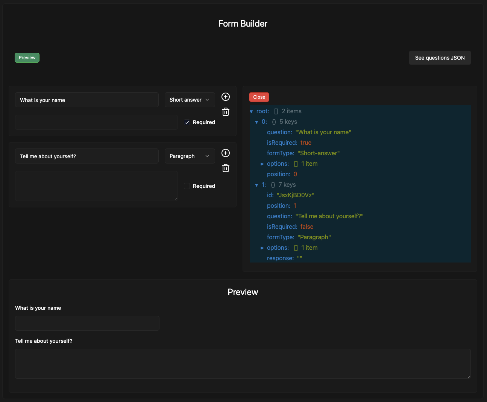

I got curious about form builders and decided to challenge myself to create one from scratch.


## Screenshot




## How to run

First, run the development server:

```bash
npm run dev
# or
yarn dev
# or
pnpm dev
# or
bun dev
```

Open [http://localhost:3000](http://localhost:3000) with your browser to see the result.
